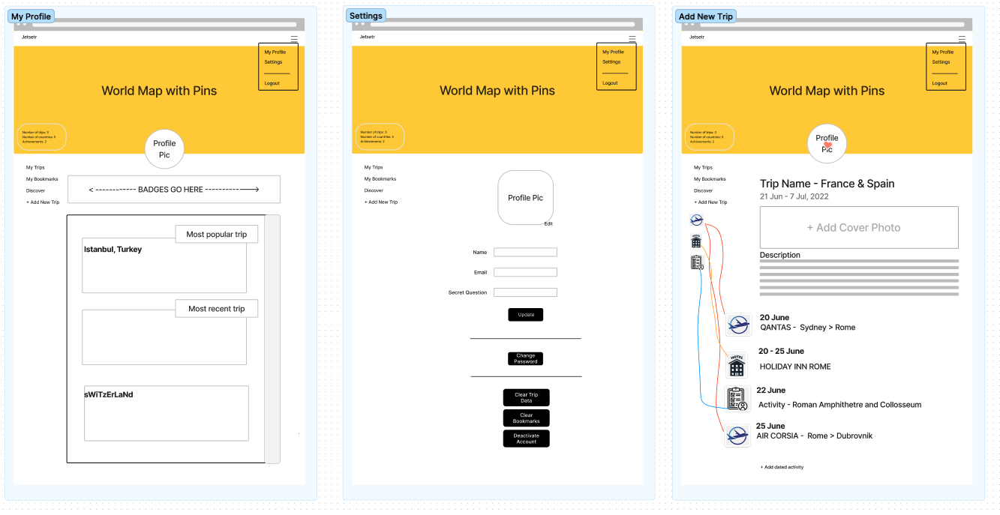
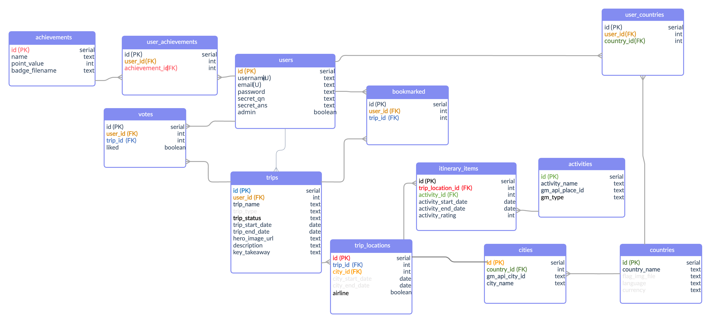

# Tript

Tript is a digital travel diary, allowing you to save details of all your favourite trips, activities & hotels. You can also search trips posted by other users allowing you to find new and exciting places to go.

You can find the Tript at [https://ga-tript.herokuapp.com/](https://ga-tript.herokuapp.com/).

## Technologies

Tript is a single page application built in node.js using the Expressjs framework, hosted by Heroku. The app uses the following node.js packages:

axios
bcrypt
connect-pg-simple
dotenv
express
express-session
pg

We built our wireframes on [figma.com](https://www.figma.com/) and our database design on [creately.com](https://app.creately.com/).

## Wireframes

Some of our original designs are below:

And here is our database design:

## Google API

We used two sets of Google APIs, Google Place Autocomplete and Google Places. The autocomplete api allows us to search for all activities & businesses around the world, and the Places API allows us to get the details of the places to store within our databases. More information on those APIs here: [https://developers.google.com/maps](https://developers.google.com/maps)

## Future features

